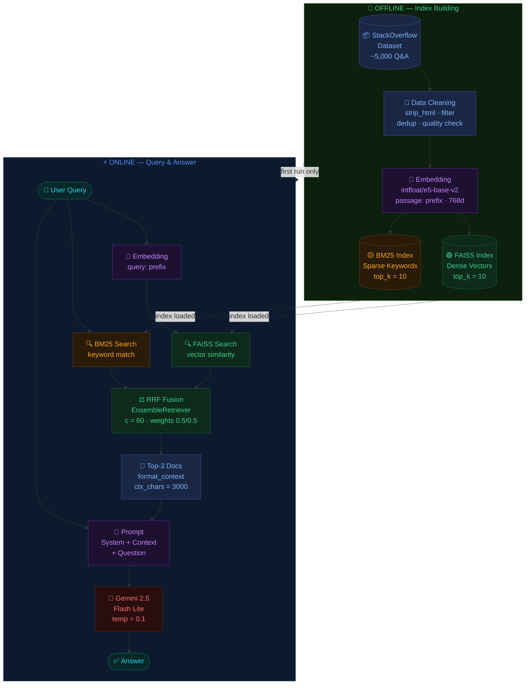

# ⎈ K8s Tech Support — RAG-powered Kubernetes Assistant

A Kubernetes Q&A assistant built with **Retrieval-Augmented Generation (RAG)**, combining Hybrid Search (BM25 + Dense Vector) with Google Gemini to answer questions grounded in real StackOverflow data.

---

## Problem Statement

Large Language Models (LLMs) like Gemini are powerful but suffer from two key limitations when used for technical Q&A:

- **Hallucination** — models can confidently generate incorrect kubectl commands, wrong API field names, or non-existent flags.
- **Knowledge cutoff** — models have no awareness of domain-specific community knowledge, real-world edge cases, or production debugging patterns.

This project addresses both issues by applying **RAG**: instead of relying solely on the model's parametric memory, every answer is grounded in a curated knowledge base of real Kubernetes questions and answers from StackOverflow. The model only generates — it does not guess.

---

## Dataset

**Source:** [`mcipriano/stackoverflow-kubernetes-questions`](https://huggingface.co/datasets/mcipriano/stackoverflow-kubernetes-questions) on HuggingFace

**Content:** Kubernetes-related Q&A pairs scraped from StackOverflow, covering pod management, deployments, services, ConfigMaps, debugging, RBAC, networking, Helm, and more.

**Preprocessing pipeline:**
- HTML tag removal via BeautifulSoup (preserving inline code blocks)
- Low-quality answer filtering (too short, link-only, duplicate detection)
- MD5-based deduplication on normalized question text
- Final size: ~5,000 clean Q&A documents

---

## Technical Background

### 1. Retrieval-Augmented Generation (RAG)
RAG augments an LLM with an external knowledge base at inference time. Given a user query, the system retrieves the most relevant documents, injects them into the prompt as context, and lets the model generate a grounded answer — rather than relying purely on its training weights.

### 2. Text Embedding
Text is encoded into dense vectors using **`intfloat/e5-base-v2`** (768 dimensions), a sentence transformer model optimized for retrieval tasks. Queries use the prefix `query:` and documents use `passage:` to improve retrieval quality.

### 3. Dense Retrieval — FAISS
Facebook AI Similarity Search (FAISS) stores all document embeddings and performs approximate nearest-neighbor search using cosine similarity. Retrieves semantically similar documents even when the exact keywords differ.

### 4. Sparse Retrieval — BM25
BM25 (Best Match 25) is a classic keyword-based ranking algorithm that scores documents based on term frequency and inverse document frequency. Excels at exact keyword matching — crucial for technical queries with specific command names or field names.

### 5. Hybrid Search with RRF
Neither dense nor sparse retrieval alone is sufficient. Dense search may miss exact keyword matches; sparse search cannot capture semantic similarity. **Hybrid Search** combines both using **Reciprocal Rank Fusion (RRF)**:

```
RRF score = Σ 1 / (c + rank_i)    where c = 60
```

Documents are ranked by their position in each list, not their raw scores — making fusion robust to score scale differences. Implemented via LangChain's `EnsembleRetriever` with equal weights (0.5 / 0.5).

### 6. LangChain LCEL
The pipeline is built using **LangChain Expression Language (LCEL)** — a declarative chain syntax using the `|` operator. Each step receives and passes a dictionary, enabling clean composition:

```
HybridRetriever → format_context → ChatPromptTemplate → Gemini → StrOutputParser
```

`RunnablePassthrough.assign()` injects new keys into the dict at each step without losing previous data.

### 7. LLM — Gemini 2.5 Flash Lite
Google's **Gemini 2.5 Flash Lite** is used for generation — lightweight and optimized for low-latency tasks. Key settings: `temperature=0.1` (near-deterministic), `max_output_tokens=1024`, `thinking_budget=0` (maximizes output token budget).

---

## Pipeline Workflow



---

## Project Structure

```
k8s_rag/
├── app.py                  # Streamlit entrypoint
├── .env                    # API key (not committed)
├── requirements.txt
├── config/
│   └── settings.py         # Reads .env, exposes all config as a singleton
├── data/
│   ├── faiss_k8s_lc/       # FAISS index (auto-built on first run)
│   └── docs_k8s.json       # Cleaned dataset cache (auto-built on first run)
└── src/
    ├── rag/
    │   ├── data_loader.py  # Dataset loading, cleaning, caching
    │   ├── indexer.py      # FAISS + BM25 + EnsembleRetriever
    │   ├── prompt.py       # System prompt + ChatPromptTemplate
    │   └── chain.py        # LCEL chain + run_query()
    └── ui/
        ├── sidebar.py      # Settings sidebar
        ├── chat.py         # Chat history + input
        └── styles.py       # CSS (blue-black terminal theme)
```

---

## Setup

### Prerequisites
- Python 3.10+
- Gemini API key — get one free at [aistudio.google.com](https://aistudio.google.com)

### Steps

```bash
# 1. Clone
git clone https://github.com/DuckK020105/AI_Project_K8S_Support.git
cd AI_Project_K8S_Support

# 2. Install dependencies
pip install -r requirements.txt

# 3. Set API key
cp .env.example .env
# Edit .env and fill in GEMINI_API_KEY

# 4. Run
streamlit run app.py
```

> First launch: click **Load Index** in the sidebar. Dataset download + FAISS index build takes ~3–5 minutes. Subsequent launches load from disk instantly.

## Evaluation

Run the evaluation script to assess answer quality on 10 test questions:

```bash
python evaluate.py
```

The script evaluates each answer on two criteria scored 1–5 by Gemini:

| Criteria | Description |
|----------|-------------|
| **Faithfulness** | Does the answer rely on retrieved docs rather than hallucinating? |
| **Relevance** | Does the answer actually address the question asked? |

### Results

| # | Type | Question | Faithfulness | Relevance |
|---|------|----------|-------------|-----------|
| 1 | Troubleshooting | My pod is stuck in CrashLoopBackOff | 4/5 | 5/5 |
| 2 | Troubleshooting | My pod status is OOMKilled | 1/5 | 1/5 |
| 3 | Troubleshooting | Pods stuck in Pending state | 2/5 | 4/5 |
| 4 | Troubleshooting | Pod shows ImagePullBackOff error | 4/5 | 5/5 |
| 5 | How-to | How do I create a ConfigMap? | 3/5 | 4/5 |
| 6 | How-to | How do I expose a deployment as a service? | 3/5 | 4/5 |
| 7 | How-to | How do I get logs from a running pod? | 4/5 | 5/5 |
| 8 | Concept | What is a Pod in Kubernetes? | 3/5 | 5/5 |
| 9 | Concept | Deployment vs StatefulSet? | 3/5 | 4/5 |
| 10 | Concept | What is a Kubernetes namespace? | 2/5 | 5/5 |
| **Avg** | | | **2.9/5** | **4.2/5** |

> Relevance (4.2/5) indicates the system consistently answers on-topic. Lower Faithfulness (2.9/5) reflects dataset coverage limitations — when retrieval returns relevant docs, Faithfulness reaches 4/5; when docs are unavailable for a topic, the model falls back to general Kubernetes knowledge.

---

## Supported Question Types

| Type | Triggers | Example |
|------|----------|---------|
| **Troubleshooting** | errors, crash, CrashLoopBackOff, not working | *My pod is stuck in CrashLoopBackOff* |
| **How-to** | how do I, how to, steps to, create a | *How do I expose a deployment as a service?* |
| **Concept** | what is, difference between, explain | *What is a ConfigMap?* |

---

## Tech Stack

| Component | Tool |
|-----------|------|
| Framework | LangChain (LCEL) |
| Dense retrieval | FAISS + intfloat/e5-base-v2 |
| Sparse retrieval | BM25 (rank-bm25) |
| Fusion | EnsembleRetriever — RRF (c=60) |
| LLM | Gemini 2.5 Flash Lite |
| Web UI | Streamlit |
| Dataset | stackoverflow-kubernetes-questions (HuggingFace) |
